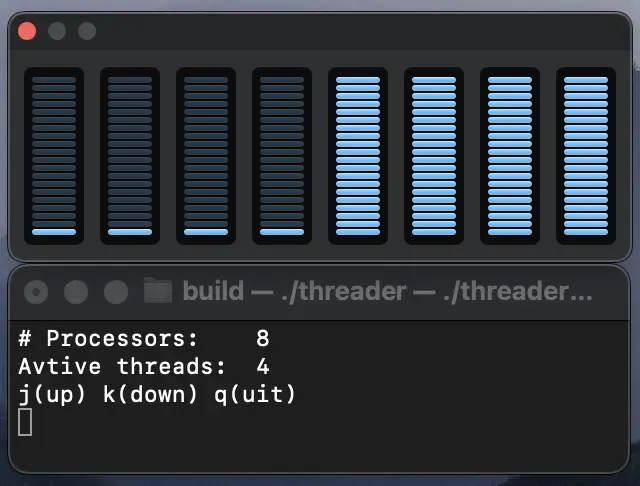

<h1>
   
   Threader
</h1>

A thread burner utility. It spins up threads and gives your processor a workout. Use `j` or `k` to modify the number of threads.



## Use Cases
- **Test CPU/core scaling**: Run with 1 thread per core to verify the CPU can scale up to full capacity
- **Concurrency issues**: Threading bugs like deadlocks may only appear under heavy thread contention
- **Benchmark throughput**: Measure maximum throughput of a system under a full CPU load
- **Test stability**: Running a soak test over an extended time can reveal stability issues
- **Simulation**: Threader can simulate high CPU usage that may occur in production due to multiple processes or users
- **Thermal testing**: Maximizing CPU usage generates heat that can be used for thermal testing
- **Isolate problems**: If a system crashes under a thread burner test, it points to a CPU/threading related issue vs. something like I/O

## Build
```
git clone https://github.com/rthomp10/threader.git
cd threader
mkdir build && cd build
cmake ..
make
./threader
```
